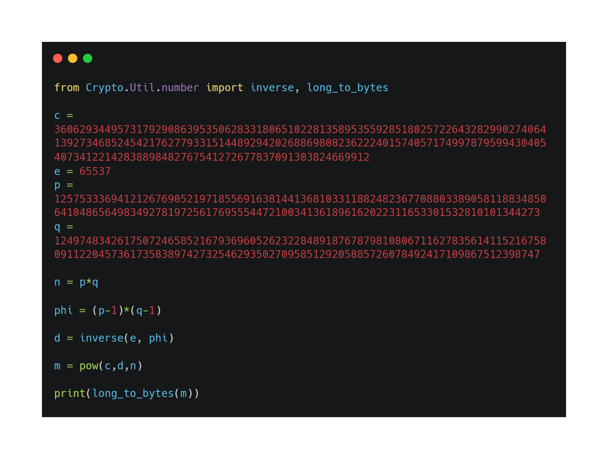

# Secrets Behind a Letter
> Melon and Edith went to an labyrinth and they should break the code written on a letter in a box in order to escape the labyrinth.

> Open the letter and break the code

## About the Challenge
Given a file containing `p`, `q`, `e`, and `c`
```
p:
12575333694121267690521971855691638144136810331188248236770880338905811883
48506410486564983492781972561769555447210034136189616202231165330153281010
1344273
q:
12497483426175072465852167936960526232284891876787981080671162783561411521
67580911220457361735838974273254629350270958512920588572607849241710986751
2398747
c:
36062934495731792908639535062833180651022813589535592851802572264328299027
40641392734685245421762779331514489294202688698082362224015740571749978795
99430405407341221428388984827675412726778370913038246699129635727146561394
22011853028133556111405072526509839846701570133437746102727644982344712571
844332280218
e = 65537
```

The variable `c` is the encrypted flag. The variable `e` is the exponent, and `p` and `q` are the two prime numbers used to generate the private and public keys.

## How to Solve?
To solve this problem, I created a python script like the image below (You can access the solver [here])



The variable `n` is the RSA modulus, which is the result of multiplying `p` and `q`. Next, the variable `phi` is calculated using Euler's totient function, namely `(p-1)*(q-1)`. The variable `d` is then calculated using the inverse modulo of `e` and `phi`, which are the RSA private keys. And in the last line, the `pow()` function is used to calculate flags that have been encrypted using the public key, using the private key. The result is converted to bytes using the `long_to_bytes()` function and we get the flag.


```
ARA2023{1t_turn5_0ut_to_b3_an_rsa}
```