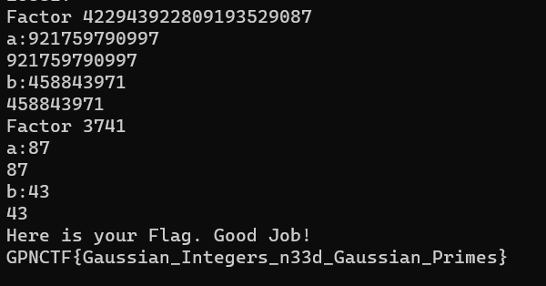

# ref4ctory
> Hello, today we wanted to refactor some integers. It turns out the (re)factor thing is quite challenging. Can you help us out?

## About the Challenge
We have been given 

```python
import sys
import ast
def check_factors(a,b,ab):
    if abs(a)<=1 or abs(b)<=1:
        print("too easy")
        return False
    if type(a*b) == float:
        print("no floats please")
        return False
    return a*b == ab 


factors = [4,10,0x123120,38201373467,247867822373,422943922809193529087,3741]

for composite in factors:
    print(f"Factor {composite}")
    a = ast.literal_eval(input("a:").strip())
    b = ast.literal_eval(input("b:").strip())
    
    if check_factors(a,b,composite):

        continue
    break
else:
    print("Here is your Flag. Good Job!")
    print(open("flag.txt").read())
```

This code presents a challenge where the user needs to find `a` and `b` values that multiply to match a given composite number. The user inputs their values, and the code checks if the inputs satisfy certain conditions. If the user correctly finds the values for all composite numbers, user will obtain the flag

## How to Solve?
To solve this problem im using `factordb`, for example

```shell
$ factordb 4
2 2

$ factordb 3741
3 29 43
```

As you can see in the last command, the output was `3 29 43`. Since we can only input 2 digits on the server, we need to multiply 29 and 3



```
GPNCTF{Gaussian_Integers_n33d_Gaussian_primes}
```