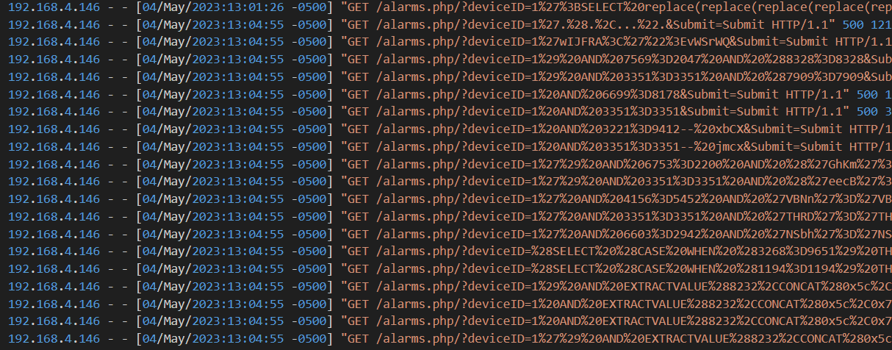

# The Historian Channel - 1
> Jubilife’s security operations center (SOC) team has noticed some alarms are missing from a historian dashboard on one of the internal ICS networks. This historian runs an Apache web server to host its database and allows users to query various settings, statuses, alarms, and warnings from devices on the network.

> In these challenges, you will work with Jubilife’s SOC team to review the historian’s Apache logs and determine whether there is evidence of adversarial activity, and figure out how the alarms were deleted from the database.

> Attached is the historian’s access.log file from the time period the SOC team would like you to review. Most users logged into the historian’s web server on their first attempt, if not their second or third, but one user repeatedly failed in an apparent brute force attempt before eventually logging in successfully.

> What time did the suspicious user successfully login?

> Flag format: timestamp of the successful login from the suspicious user, without the timezone. Example: if the timestamp was [04/May/2023:09:24:56 -0500], the flag would be 04/May/2023:09:24:56

## About the Challenge
We have been given a log file to analyze (You can download the file [here](access.log)). And we need to find the timestamp of the succesful login from the suspicious user

## How to Solve?
If we check content of the log file, you will see some suspicious requests from `192.168.4.146`



So, im using this regex

```
192.168.4.146 - - .* "POST /login.php
```

To determine when a suspicious user accessed the login page, you need to consider that some of the requests made after submitting the `POST` method to `login.php` will result in the user being redirected back to the `login.php` page. This is due to the logic of the website, which redirects users back to the login page if they cannot provide correct credentials.


But in line 190, after sending the `POST` request to the login.php page, the user is redirected to `index.php`. Therefore, the attacker has successfully logged in to the website.

```
04/May/2023:12:22:50
```