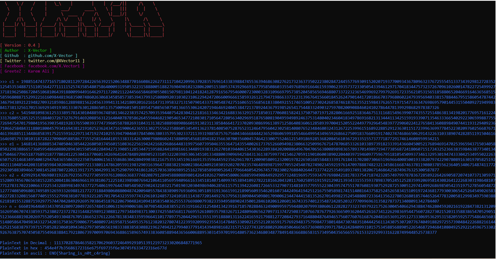

# twin
> The twins Alice and Bob are so close that they share everything, even the modulus of their RSA keys.

## About the Challenge
We have been given a zip file (you can get the source code [here](twin.zip)), and inside the file, there are four files. The first file is named `cipher`, which contains ciphertext. There is also a file named `chall.py` that contains a Python script to encrypt the flag, as well as two files named `key1.pem` and `key2.pem`, which are RSA public keys.

## How to Solve?
If we check on the `chall.py`

```python
from Crypto.PublicKey import RSA
from Crypto.Util.number import bytes_to_long
from binascii import hexlify

from secret import flag

key1 = RSA.import_key(open('key1.pem','rb').read())
key2 = RSA.import_key(open('key2.pem','rb').read())

c1 = pow(bytes_to_long(flag), key1.e, key1.n)
c2 = pow(bytes_to_long(flag), key2.e, key2.n)

writer = open('ciphers','w')
writer.write('%d\n%d' % (c1, c2))
writer.close()
```

The script reads in two RSA keys from files named `key1.pem` and `key2.pem`. And then the script then uses the `bytes_to_long` function to convert the flag variable from bytes to an `int`. It then uses the `pow` function to encrypt this integer using the two RSA keys. The resulting ciphertexts are stored in variables named `c1` and `c2`. Finally, the script writes the ciphertext to a file named `ciphers`. Pretty simple right?

In the challenge description, it is stated that the public keys have the same modulus. Therefore, it can be determined that to obtain the flag, one needs to perform an attack on the RSA key using the `Common Modulus Attack`

Im using [X-RSA](https://github.com/X-Vector/X-RSA) instead of `RsaCtfTool` because that tool is broken on my machine. And voila you will get the flag by choosing `Common Modulus` option



```
ENO{5har1ng_is_n0t_c4r1ng}
```