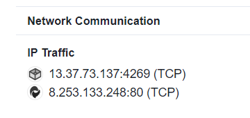

# Black Pandora
> Duncan just traded-off a device with a very promising price at a shop near the town. The seller is even more generous that he offers a program that can give Duncan a huge amount of money. Welp, Duncan is not really aware of the device's security so he just did what the seller tell him to do, and now there's an **annoying popup** that always get opened once he would like to **open a file directory**.

> Can you investigate what's happening on his device?

> Important Notes: Ignore the bitcoin stuff (like Kleopatra/GPG/bitcoin app/related files) as it's not related to the challenge.

## About the Challenge
We have been given an image forensic challenge (on a memory). Additionally, we have received 5 questions that we need to answer correctly in order to obtain the flag.

## How to Solve?
In this case, im using Volatility 2 to do forensic on a memory. First, im gonna use `imageinfo` first to find the correct profile for this image. Here is the command that I used to find the correct profile:

```shell
vol.py -f OdysseyVM-ded1be8a.vmem imageinfo
```


As you can see, there are a lot of suggested profiles that you can use, but in this case im gonna use `Win7SP1x64`.  First im using `psxview` module to find hidden process, here is the output and the command when i used `psxview` module

```shell
vol.py -f OdysseyVM-ded1be8a.vmem --profile=Win7SP1x64 psxview
```


Hmmm there is a proccess called `clickheretoget....`. It looks like the name program has been truncated. Let's see the full name using `filescan` module. Here is the command that I used to find the full name of the suspicious program

```shell
vol.py -f OdysseyVM-ded1be8a.vmem --profile=Win7SP1x64 filescan | grep "clickhere"
```


The file name is `clickheretogetmoney.exe` and now we need to dump it. But I failed when I want to dump the proccess. So, the next thing I want to do is print list of loaded dlls for each process (Especially clickheretogetmoney process). So im using `dlllist` module just hoping there is `clickheretogetmoney` proccess

```
vol.py -f OdysseyVM-ded1be8a.vmem --profile=Win7SP1x64 dlllist | grep "Money"
```


But hey, there is a DLL file called `Money_UwU.dll`? Interesting, lets try to dump the dll file using `dumpfiles` module

```
vol.py -f OdysseyVM-ded1be8a.vmem --profile=Win7SP1x64 dumpfiles -r money -i --dump-dir dumpdir/
```


And now, upload the file into `tria.ge`


The popup title is `Zeus Shop Offer`


For question number 2, we already got the answer by using `psxview` and `filescan` module before


For question number 3, we can use `pstree` module to find the PID and the parent PID. Here is the command that I used to obtain the pid and ppid

```shell
vol.py -f OdysseyVM-ded1be8a.vmem --profile=Win7SP1x64 psscan
```


The PID is 328 and the PPID is 1776


For question number 4, has been answered by one of the team member, he debug the dll file and find the actual MD5 hash


For question number 5, im using dynamic analysis approach, so I upload the DLL code into Virustotal, and you can find the attacker's IP and port on the behaviour menu



The IP and the port is `13.37.73.137:4269`


And voila, you obtain the flag


```
flag{th3_p4nd0r4_!s_f1n4lly_cl0sed_:pepega:}
```